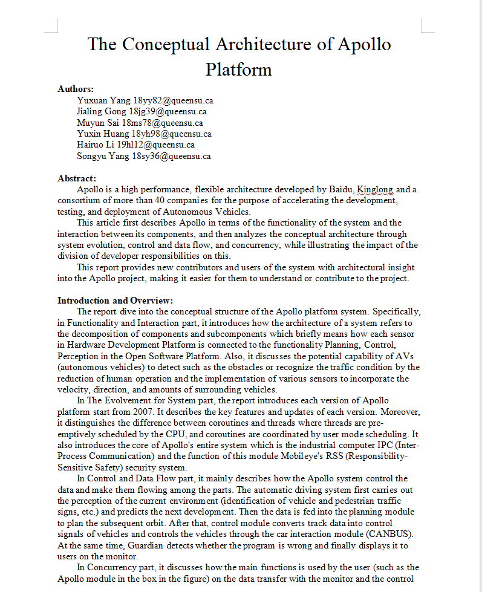
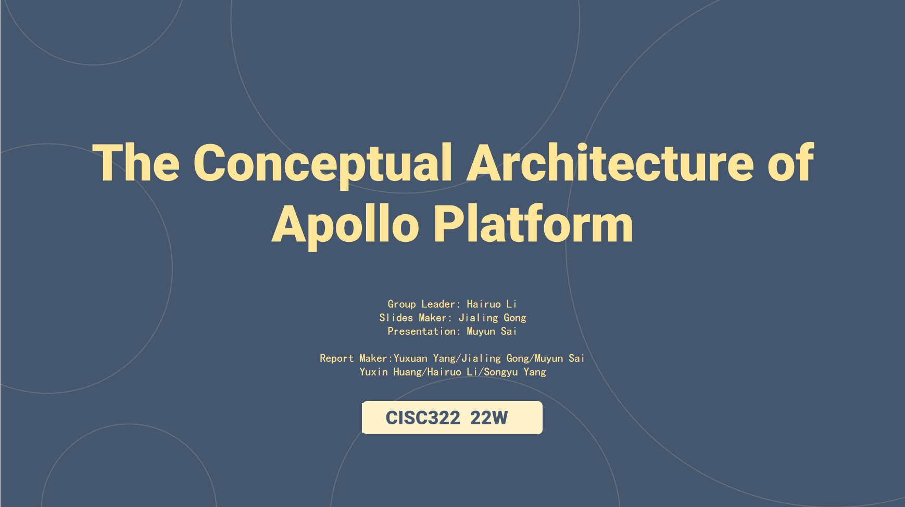

<h1>Welcome to Wanna Run</h1>
### Software Architecture

 Winter 2022 - Queen's University 

 CISC 322/326 

# Assignments
Assignments from group 23 of CISC322 W22
<html>
<head>

</head>
<body>

	
Assignment 1

	

			

				
Report

				
				<button onclick="window.location.href = 'A1/A1-report.docx'" class="button" style="vertical-align:right">View More </button>
				

		

			

				
PPT

				
				<button onclick="window.location.href = 'A1/A1-slits.pptx'" class="button">View More </button>
				

			

					
Presentation

					<video width="200" controls>
  						<source src="A1/A1-presentation.mp4" type="video/mp4">
					</video>
				

		

			
		

	
Assignment 2

	
	

			

				
Report

				

		

			

				
PPT

				

			

					
Presentation

					<video width="200" controls>
  						<source>
					</video>
				

		

			
		

	
	
Assignment 3

	

			

				
Report

				

		

			

				
PPT

				

			

					
Presentation

					<video width="200" controls>
  						<source>
					</video>
				

		

			
		

	
<html>
<head>

</head>
<body>

<h1>Group Members</h1>

Here are the members' information of WannaRun.

	

			

				
				
Yuxin Huang

					[Mail]<a href="mailto:18yh98@queensu.ca">18yh98@queensu.ca</a>
					[GitHub]<a href="https://github.com/YuxinHuang01">https://github.com/YuxinHuang01</a>
					

				
				

					
					
Muyun Sai

					[Mail]<a href="mailto:18ms78@queensu.ca">18ms78@queensu.ca</a>
					[GitHub]<a href="https://github.com/18ms78">https://github.com/18ms78</a>
				

	

			

				
					
Jialin Gong

					[Mail]<a href="mailto:18jg39@queensu.ca">18jg39@queensu.ca</a>
					[GitHub]<a href="https://github.com/18jg39">https://github.com/18jg39</a>
			

		

	
		

        

		

				
					
Hairuo Li

					[Mail]<a href="mailto:19hl12@queensu.ca">19hl12@queensu.ca</a>
					[GitHub]<a href="https://github.com/19hl12">https://github.com/19hl12</a>
			

		
		

				
					
Yuxuan Yang

					[Mail]<a href="mailto:18yy82@queensu.ca">18yy82@queensu.ca</a>
					[GitHub]<a href="https://github.com/18yy82">https://github.com/18yy82</a>
			

		
		

				
					
Songyu Yang

					[Mail]<a href="mailto:18sy36@queensu.ca">18sy36@queensu.ca</a>
					[GitHub]<a href="https://github.com/shallowManica">https://github.com/shallowManica</a>
			
			

	

	

</body>
</html>

Links

	
	
Assignment 1 reference

	
Assignment 2 reference

	
Assignment 3 reference

